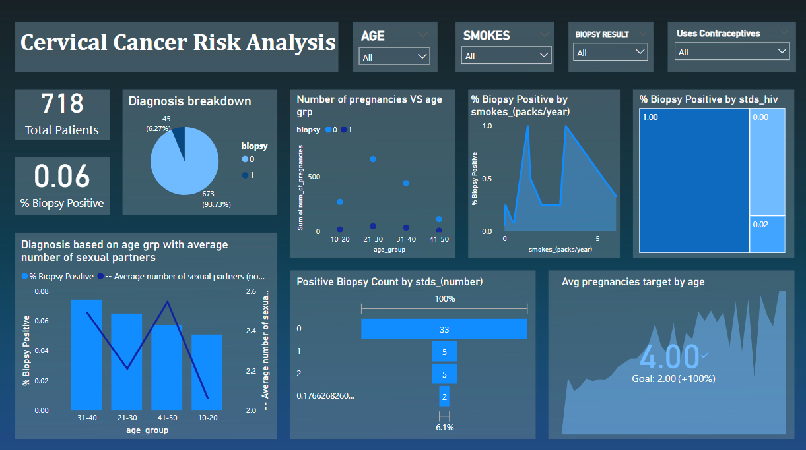

# Cervical_cancer_risk_analysis
End-to-end cervical cancer analytics using Python , EDA , ML & Power BI
# 🧬 Cervical Cancer Risk Factor Analysis

An end-to-end data analytics and predictive modeling project focused on identifying and visualizing key risk factors of cervical cancer using Python and Power BI.

> 🚺 Empowering early detection through data-driven insights.

---

## 📌 Overview

This project analyzes a real-world cervical cancer dataset using a combination of:
- **Python** (for data cleaning, EDA, and machine learning)
- **Power BI** (for advanced dashboarding and KPIs)

The final product includes a full-featured interactive dashboard, predictive analysis, and key takeaways for healthcare stakeholders.

---

## 🛠️ Tools & Technologies

- Python (Pandas, Seaborn, Scikit-learn, Matplotlib)
- Jupyter Notebook / Google Colab
- Power BI (DAX, Slicers, KPIs, Custom Visuals)
- Git & GitHub for version control

---

## 📁 Project Structure

| File / Folder | Description |
|---------------|-------------|
| `cleaned_cervical_cancer_data.csv` | Cleaned dataset used in analysis and SQL |
| `cervical_cancer_notebook.ipynb` | Python notebook with EDA + prediction model |
| `cervical cancer dashboard.pbix` | Power BI dashboard with KPIs & visuals |
| `images` | Screenshots of dashboard for README |
| `README.md` | Project overview and documentation |

---

## 🔍 Key Steps

1. **Data Cleaning**: Handled missing values, outliers, and data types
2. **EDA**: Explored correlations between age, sexual activity, STDs, smoking, and cancer diagnosis
3. **Predictive Modeling**: Logistic regression model to classify biopsy results
4. **Dashboard**: Built an interactive dashboard in Power BI using DAX, slicers, trend KPIs, decomposition trees, and more

---

## 📈 Dashboard Preview

---

## 📊 Key Dashboard Features

- ✅ KPI Cards (Positive cases, HPV+ rates, Prediction Accuracy)
- 📉 Trend Analysis (age vs. biopsy, STDs vs. diagnosis)
- 🧠 Key Influencers (HPV, STD history, pregnancies)
- 📍 Filters by age group, contraceptive use, smoking habits
- 🔍 Funnel, Treemap, Histogram, and Decomposition visuals

---

## 💡 Insights

- Patients with multiple STDs or HPV are significantly more likely to test biopsy-positive.
- Smoking, early sexual activity, and high pregnancy counts correlate with risk.
- Logistic regression showed ~90% accuracy in identifying positive biopsy outcomes.

---

## 🧠 Real-World Applications

- Early screening programs can use these risk factors for targeted diagnostics.
- Healthcare providers can design prevention campaigns around key behaviors.
- The dashboard can assist clinics in visualizing patient risk profiles in real-time.

---

## 📦 Dataset Source

- [UCI Machine Learning Repository – Cervical Cancer](https://archive.ics.uci.edu/ml/datasets/Cervical+Cancer+Behavior+Risk)

---

## 🤝 Let's Connect

If you found this project useful or inspiring, feel free to ⭐ star the repo 
---

